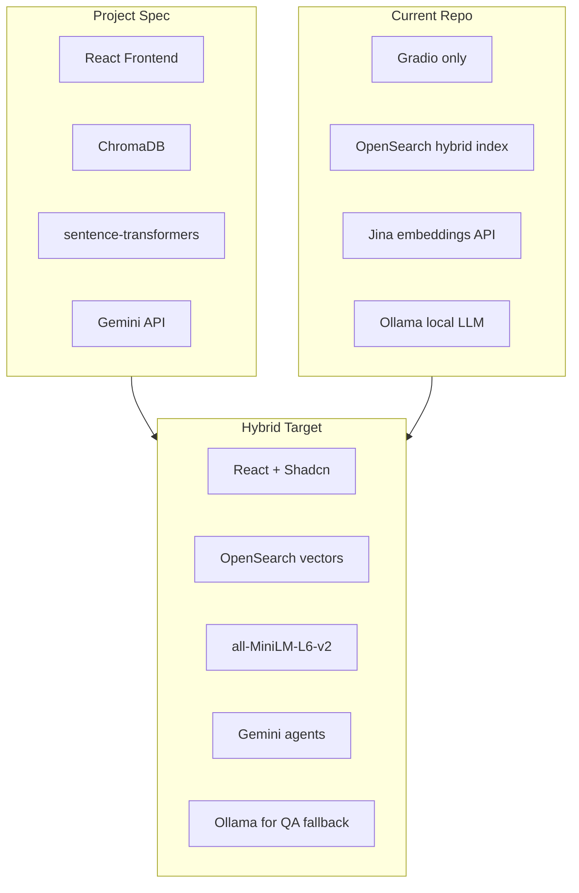
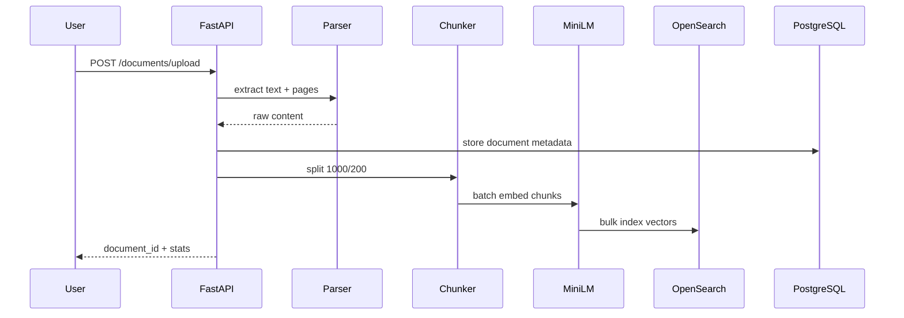
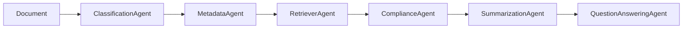

# Enterprise Document Intelligence Platform — Gap Analysis & Implementation Plan

## Current State Summary

This repository is a **backend-first enterprise RAG scaffold** (evolved from an arXiv RAG demo) with substantial enterprise infrastructure already sketched, but it **cannot run end-to-end today** due to missing modules and build files. There is **no React frontend** — only a minimal Gradio chat prototype ([`src/gradio_app.py`](src/gradio_app.py)).

**Your chosen stack (Hybrid):** Keep OpenSearch + PostgreSQL + Redis; add **sentence-transformers** for embeddings; use **Gemini** for classification/metadata/compliance/summarization agents; build **React + Tailwind + Shadcn** frontend.



---

## What Already Exists

### Infrastructure & Backend Shell

| Area | Status | Key Files |
|------|--------|-----------|
| FastAPI app + lifespan | Implemented | [`src/main.py`](src/main.py) |
| Docker Compose (13 services) | Partial | [`compose.yml`](compose.yml) — postgres, redis, opensearch, ollama, airflow, langfuse |
| Config / env | Implemented | [`src/config.py`](src/config.py), [`.env.example`](.env.example) |
| JWT middleware + RBAC hooks | Partial | [`src/middlewares.py`](src/middlewares.py), [`src/services/security/`](src/services/security/) |
| Redis cache | Implemented | [`src/services/cache/`](src/services/cache/) |
| Langfuse tracing | Implemented | [`src/services/langfuse/`](src/services/langfuse/) |
| Airflow ingestion DAG | Partial | [`airflow/dag/`](airflow/dag/) — scan → validate → parse → index |

### Phase 1 — Document Pipeline (Partial)

| Spec Requirement | Repo Reality |
|------------------|--------------|
| `POST /api/upload` | **Partial** — [`src/routers/document_management.py`](src/routers/document_management.py) has `POST /upload` but router prefix is `/api/v1/documents` and main adds `/api/v1` again → **double prefix bug** (`/api/v1/api/v1/documents/upload`) |
| PDF/DOCX/TXT parsing | **Partial** — Docling + Office parser in [`src/services/pdf_parser/`](src/services/pdf_parser/); missing `schemas/pdf_parser/models.py`; no PyPDF/PyMuPDF/python-docx as spec requires |
| RecursiveCharacterTextSplitter 1000/200 | **Different** — word-based [`TextChunker`](src/services/indexing/text_chunker.py) at 600/100 words |
| sentence-transformers embeddings | **Missing** — Jina API client in [`src/services/embeddings/jina_client.py`](src/services/embeddings/jina_client.py) |
| ChromaDB vector store | **Different** — OpenSearch hybrid index via [`HybridIndexingService`](src/services/indexing/hybrid_indexer.py); **OpenSearch client module missing entirely** |

### Phase 2–8 — AI Agents & Intelligence (Partial)

| Phase | Status |
|-------|--------|
| **2 Classification** | Missing — `document_type` is a manual upload form field |
| **3 Metadata extraction** | Missing — no per-type structured extraction or `DocumentMetadata` table |
| **4 Semantic search** | **Partial** — [`POST /api/v1/hybrid-search`](src/routers/hybrid_search.py) (BM25 + vector + RRF); no dedicated `/search` alias |
| **5 Multi-agent LangGraph** | **Partial** — QA graph only: guardrail → retrieve → grade → rewrite → generate in [`src/services/agents/agentic_rag.py`](src/services/agents/agentic_rag.py); not the spec's 6-agent ingestion pipeline |
| **6 Compliance** | Missing — only PII regex in [`pii_detector.py`](src/services/document_ingestion/pii_detector.py) |
| **7 Summarization** | Missing |
| **8 Q&A with citations** | **Partial** — [`POST /api/v1/ask-agentic`](src/routers/agentic_ask.py); legacy [`ask.py`](src/routers/ask.py) not registered |

### Phase 9–15 — Frontend, Auth, Schema, Docker

| Phase | Status |
|-------|--------|
| **9 Analytics dashboard** | Missing — only admin audit stats at `/admin/audit/stats` |
| **10 Auth** | **Partial** — login/logout/me with **hardcoded stub users** (`admin/admin123`); no signup; no DB-backed auth despite [`User`](src/models/user.py) model |
| **11 REST API surface** | **Partial** — missing `/classify`, `/metadata`, `/compliance`, `/summarize`, `/analytics`, `/agents/run`, `/chat`; several routers unregistered |
| **12 Database schema** | **Partial** — 2/8 spec tables (`users`, `documents`); extras: `audit_logs`, `policies`, `permissions`; no Alembic; [`Document`](src/models/document.py) has `Integer` used but not imported |
| **13 Frontend pages** | **Missing** — no React app |
| **14 Agent workflow viz** | **Missing** |
| **15 Dockerization** | **Partial** — no frontend service; **API build broken** (Dockerfile expects missing `pyproject.toml`/`uv.lock`); Airflow DAG mount path mismatch (`dags` vs `dag`) |

### Registered API Endpoints Today

From [`src/main.py`](src/main.py):

- `GET /api/v1/health`
- `POST /api/v1/hybrid-search/`
- Document CRUD + versions (prefix bug)
- `POST /api/v1/login`, `/login/json`, `GET /me`, `POST /logout`
- `POST /api/v1/ask-agentic`, `POST /api/v1/feedback`
- Admin audit endpoints

**Not registered:** [`ask.py`](src/routers/ask.py), [`admin/users.py`](src/routers/admin/users.py), [`admin/policies.py`](src/routers/admin/policies.py), [`auth/permissions.py`](src/routers/auth/permissions.py)

---

## Critical Runtime Blockers (Phase 0 — Do First)

Before Phase 1 features can be tested, fix these **missing/broken dependencies**:

1. **Build system** — Create [`pyproject.toml`](pyproject.toml) + `uv.lock` (Dockerfile and README both reference them)
2. **Missing schema modules** referenced across the codebase:
   - `src/schemas/database/config.py`
   - `src/schemas/pdf_parser/models.py`
   - `src/schemas/indexing/models.py`
   - `src/schemas/embeddings/jina.py` (+ new `embeddings/local.py` for sentence-transformers)
3. **Missing service modules:**
   - `src/services/opensearch/` (client, factory) — imported in 10+ files
   - `src/services/document_ingestion/virus_scanner.py`
   - Stub or remove `src/services/telegram/` (imported in main.py)
4. **Router prefix fix** — Change [`document_management.py`](src/routers/document_management.py) router prefix from `/api/v1/documents` to `/documents`
5. **Model registration** — Fix [`src/models/document.py`](src/models/document.py) (`Integer` import); expand [`src/models/__init__.py`](src/models/__init__.py) to import all models for `create_all()`
6. **Compose fixes** — Airflow volume `./airflow/dags` → `./airflow/dag`; verify API container starts

**Exit criteria:** `docker compose up` brings API to healthy state; upload endpoint reachable at `POST /api/v1/documents/upload`.

---

## Phase-by-Phase Implementation Plan

### Phase 1 — Basic Document Upload Pipeline

**Goal:** Reliable ingest path matching spec semantics (adapted to OpenSearch).

**Steps:**

1. **Upload API** — Fix prefix; accept PDF/DOCX/TXT; store files under `./data/uploads/`; return `{filename, pages, content}` preview in response
2. **Parsing layer** — Add [`src/services/parsers/`](src/services/parsers/) with:
   - PDF: PyMuPDF (primary) + PyPDF (fallback)
   - DOCX: python-docx
   - TXT: direct read
   - Keep Docling as optional enhanced parser for complex PDFs
3. **Chunking** — Add `LangChain RecursiveCharacterTextSplitter` wrapper (chunk_size=1000, overlap=200) in new [`src/services/indexing/recursive_chunker.py`](src/services/indexing/recursive_chunker.py); use for upload pipeline; retain section-aware chunker as optional
4. **Embeddings** — Add [`src/services/embeddings/local_client.py`](src/services/embeddings/local_client.py) using `sentence-transformers/all-MiniLM-L6-v2`; configure via env (`EMBEDDINGS_PROVIDER=local|jina`); update OpenSearch index mapping to 384 dimensions when using MiniLM
5. **Vector storage** — Store in OpenSearch (spec's ChromaDB role): `{chunk_id, document_id, embedding, metadata}` per chunk document; add optional `DocumentChunks` PG table for audit/reindex
6. **Wire upload → parse → chunk → embed → index** in [`IngestionService`](src/services/document_ingestion/ingestion_service.py) (or new slim `UploadPipelineService` for API uploads)

**Interview talking points:** ingestion pipeline design, chunking trade-offs, embedding model selection, idempotent indexing.



---

### Phase 2 — Document Classification Agent

1. Create [`src/services/agents/classification_agent.py`](src/services/agents/classification_agent.py) using Gemini API
2. Prompt: classify into 10 spec categories with confidence score
3. Add `classification_result` JSON column on `documents` or new `document_classifications` table
4. Expose `POST /api/v1/classify` and auto-run after upload
5. Store `{document_type, confidence}` in PostgreSQL

---

### Phase 3 — Metadata Extraction Agent

1. Create [`src/services/agents/metadata_agent.py`](src/services/agents/metadata_agent.py) with type-specific JSON schemas (Employment Contract, Invoice, Email, HR Policy, etc.)
2. Add [`DocumentMetadata`](src/models/document_metadata.py) SQLAlchemy model (1:1 with documents)
3. Expose `POST /api/v1/metadata`
4. Chain: classification → metadata extraction in ingestion workflow

---

### Phase 4 — Semantic Search Engine

1. Refine existing hybrid search or add `POST /api/v1/search` alias
2. Return spec format: document name, relevance score, matching sections/snippets, page references
3. Add metadata filters (document_type, department, date range)
4. Log queries to new `search_queries` table for analytics

---

### Phase 5 — Multi-Agent LangGraph Workflow

Build a **new ingestion/orchestration graph** separate from the existing QA graph:



1. Create [`src/services/agents/enterprise_workflow.py`](src/services/agents/enterprise_workflow.py) with LangGraph `StateGraph`
2. Each node writes to `AgentExecutions` table (step, duration, confidence, tokens)
3. Expose `POST /api/v1/agents/run` — triggers full pipeline on a document ID
4. Keep existing [`AgenticRAGService`](src/services/agents/agentic_rag.py) for interactive Q&A (`/ask-agentic`, `/chat`)

---

### Phase 6 — Compliance Analysis

1. Create [`src/services/compliance/engine.py`](src/services/compliance/engine.py) with rule sets per document type (e.g., Employment Contract: salary, termination, confidentiality, notice, duration clauses)
2. Combine rule-based checks + Gemini risk assessment
3. Add [`ComplianceReport`](src/models/compliance_report.py) model with risk score (0–100)
4. Expose `POST /api/v1/compliance`

---

### Phase 7 — Document Summarization

1. Create [`src/services/agents/summarization_agent.py`](src/services/agents/summarization_agent.py) (Gemini)
2. Store executive summary on `documents.summary` column
3. Expose `POST /api/v1/summarize`

---

### Phase 8 — Enterprise Question Answering

1. Enhance retriever to return page-level citations (from chunk metadata)
2. Add `POST /api/v1/chat` with session support
3. Add [`ChatHistory`](src/models/chat_history.py) model
4. Response format: `{answer, sources: [{filename, page, snippet}]}`

---

### Phase 9 — Analytics Dashboard (Backend + Frontend)

1. Add [`Analytics`](src/models/analytics.py) aggregation service
2. Expose `GET /api/v1/analytics` with: doc counts by category, risk distribution, avg latency, top queries, avg confidence, compliance stats
3. React dashboard page with Recharts

---

### Phase 10 — Authentication

1. Wire [`AuthService`](src/services/security/auth_service.py) to PostgreSQL via [`UserRepository`](src/repositories/user.py)
2. Add `POST /api/v1/signup` (bcrypt password hashing)
3. Register unmounted admin routers (users, policies, permissions)
4. Scope documents to `owner_id`; chat history per user

---

### Phase 11 — REST API Consolidation

Align all spec endpoints under `/api/v1`:

| Endpoint | Action |
|----------|--------|
| `POST /upload` | Alias to `/documents/upload` |
| `GET /documents`, `GET /documents/{id}` | Exists (fix prefix) |
| `POST /search` | Alias or primary search |
| `POST /chat` | New session-based Q&A |
| `POST /classify`, `/metadata`, `/compliance`, `/summarize` | New (Phases 2–7) |
| `GET /analytics` | New (Phase 9) |
| `POST /agents/run` | New (Phase 5) |

Add OpenAPI tags and consistent error schemas.

---

### Phase 12 — Database Schema Completion

Add Alembic migrations for all spec tables:

| Table | Purpose |
|-------|---------|
| `users` | Exists — wire to auth |
| `documents` | Exists — add `summary`, `classification` columns |
| `document_metadata` | Type-specific extracted fields (JSONB) |
| `document_chunks` | Chunk registry (optional mirror of OpenSearch) |
| `chat_history` | User Q&A sessions |
| `compliance_reports` | Rule check results + risk score |
| `analytics_events` | Query/index/agent metrics |
| `agent_executions` | Per-step LangGraph telemetry |

---

### Phase 13 — React Frontend Pages

Scaffold [`frontend/`](frontend/) with Vite + React + TypeScript + Tailwind + Shadcn:

| Page | Backend APIs |
|------|--------------|
| Login / Signup | `/login`, `/signup` |
| Dashboard | `/analytics`, `/documents` |
| Upload | `/documents/upload` |
| Document Viewer | `/documents/{id}`, `/compliance`, `/summarize` |
| Semantic Search | `/search` |
| AI Chat | `/chat` or `/ask-agentic` |
| Compliance Report | `/compliance` |
| Analytics | `/analytics` |
| Agent Workflow Viz | `/agents/run` + execution history |

Shared: JWT auth context, API client, protected layout shell.

---

### Phase 14 — Agent Workflow Visualization

1. Extend `AgentExecutions` API to return structured step graph
2. React Flow component showing nodes: Classification → Metadata → Retrieval → Compliance → Summary → QA
3. Display per-node: execution time, confidence, token count
4. Link to Langfuse trace ID for deep debugging

---

### Phase 15 — Dockerization

Update [`compose.yml`](compose.yml):

```yaml
services:
  frontend:   # NEW - React nginx or Vite dev
  api:        # Fix build with pyproject.toml
  postgres:
  opensearch: # Replaces ChromaDB in hybrid stack
  redis:
  # Optional: ollama, langfuse, airflow for enterprise demo
```

Single command: `docker compose up` runs frontend (:3000) + API (:8000) + data stores.

---

## Recommended Implementation Order

| Step | Work | Depends On |
|------|------|------------|
| **0** | Unblock scaffold (pyproject, schemas, opensearch client, router fixes) | — |
| **1** | Phase 1 upload pipeline (parse → chunk → embed → index) | Step 0 |
| **2** | Phase 12 schema + Alembic foundation | Step 0 |
| **3** | Phase 2–3 Gemini agents (classify + metadata) | Steps 1, 2 |
| **4** | Phase 4 semantic search refinement | Step 1 |
| **5** | Phase 10 auth (DB-backed signup/login) | Step 2 |
| **6** | Phase 13 frontend scaffold + Upload/Search/Chat pages | Steps 1, 4, 5 |
| **7** | Phase 6–7 compliance + summarization | Step 3 |
| **8** | Phase 5 + 14 LangGraph enterprise workflow + viz | Steps 3, 7 |
| **9** | Phase 8 chat history + citations | Steps 4, 5 |
| **10** | Phase 9 analytics backend + dashboard | Steps 8, 9 |
| **11** | Phase 11 API consolidation + OpenAPI polish | All backend |
| **12** | Phase 15 Docker frontend + production compose | Step 6 |

---

## Spec vs Repo — Quick Scorecard

| Phase | Spec | Repo Today | Hybrid Target |
|-------|------|------------|---------------|
| 1 Upload pipeline | ChromaDB + MiniLM | Broken partial | OpenSearch + MiniLM |
| 2 Classification | Gemini | Manual field | Gemini agent |
| 3 Metadata | Gemini + PG | Basic doc columns | Gemini + DocumentMetadata table |
| 4 Search | Vector search | Hybrid search partial | Enhanced hybrid + `/search` |
| 5 Agents | 6-agent pipeline | QA graph only | New enterprise graph + existing QA |
| 6 Compliance | Rule engine | PII only | Rules + Gemini risk |
| 7 Summarization | Executive summary | None | Gemini + stored summary |
| 8 Q&A | Citations | Partial agentic | Page-level citations + chat history |
| 9 Analytics | Dashboard charts | Audit stats only | Full analytics API + React |
| 10 Auth | Signup + JWT | Stub users | DB-backed auth |
| 11 APIs | 11 endpoints | ~8 partial | Full REST surface |
| 12 Schema | 8 tables | 2 spec + 3 extra | All 8 + Alembic |
| 13 Frontend | React 10 pages | Gradio only | Full React app |
| 14 Agent viz | Graph UI | None | React Flow |
| 15 Docker | 5 services | 13 services, broken API | frontend + core stack |

---

## Key Architectural Decision (Documented)

**ChromaDB → OpenSearch:** In the hybrid plan, OpenSearch serves as the vector store (enterprise-grade, already scaffolded). Resume language can honestly state: *"Hybrid semantic search with BM25 + dense vectors in OpenSearch, 384-dim MiniLM embeddings."* This is stronger for enterprise interviews than ChromaDB alone.

**Jina → sentence-transformers:** Local MiniLM for dev/offline; Jina remains optional for production scale via env toggle.

**Ollama + Gemini:** Gemini for structured agent tasks (classification, metadata, compliance); Ollama for cost-free local Q&A during development.
